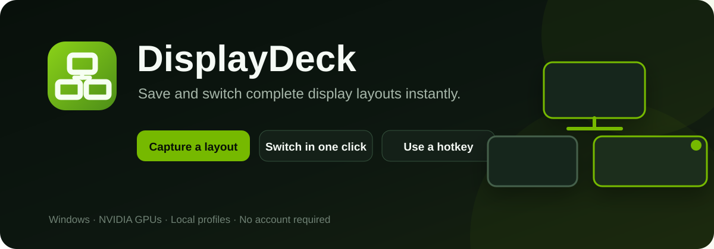
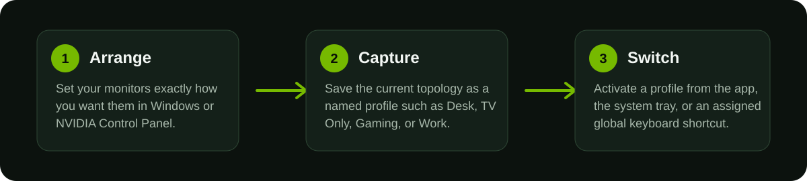

<p align="center">
  
</p>

<p align="center">
  <strong>A fast Windows utility for saving and switching complete multi-monitor layouts.</strong>
</p>

<p align="center">
  <a href="https://github.com/YungZanji/displaydeck/releases/latest">Download</a> ·
  <a href="#how-to-use-it">How to use it</a> ·
  <a href="#features">Features</a> ·
  <a href="#requirements">Requirements</a>
</p>

## What is DisplayDeck?

DisplayDeck lets you save different monitor setups as named profiles and restore them whenever you want.

A profile can represent almost any arrangement you use: all monitors active, one display by itself, a desk setup, a TV-only setup, a gaming layout, a work layout, or anything else your NVIDIA hardware supports. DisplayDeck captures the complete active display topology instead of making you repeatedly configure monitors by hand.

Everything stays local on your PC. There is no account, cloud sync, or background service required.

## How to use it

<p align="center">
  
</p>

1. **Arrange your displays** in Windows Display Settings or NVIDIA Control Panel exactly how you want them.
2. Open DisplayDeck and choose **Capture Profile**.
3. Give the layout a name.
4. Repeat for any other layouts you use.
5. Switch between profiles from DisplayDeck, the system tray, or an assigned hotkey.

You can update an existing profile at any time, so small changes do not require rebuilding your whole profile library.

## Features

- Save as many display profiles as you need
- Capture complete NVIDIA display topologies
- Switch profiles directly through NVIDIA NVAPI
- Visual previews generated from the captured monitor positions
- Rename, duplicate, reorder, favorite, update, export, import, and delete profiles
- Assign a global keyboard shortcut to any profile
- Switch profiles from the Windows notification area
- Choose a profile to load when Windows starts
- Optional **safe test** mode that automatically restores the previous layout if you do not confirm the new one
- Configurable automatic-revert timer
- Local profile backups and diagnostics
- Shortcuts to NVIDIA Control Panel and Windows Display Settings
- Responsive WPF interface with per-monitor DPI support

## Requirements

- Windows 10 or Windows 11
- An NVIDIA GPU with a current NVIDIA display driver
- NVIDIA displays/topologies supported by your GPU and driver
- .NET Framework 4.8

DisplayDeck currently uses NVIDIA NVAPI as its display backend, so AMD- and Intel-only systems are not supported in this release.

## Install

The easiest way to install DisplayDeck is from the **Releases** section:

1. Download the latest Windows package.
2. Extract it if necessary.
3. Run `Setup.cmd`.
4. Launch **DisplayDeck** from the Start menu or desktop shortcut.

If you downloaded the repository source directly, `Setup.cmd` builds the WPF application locally using the .NET Framework compiler already available on Windows. A packaged release includes the native NVAPI engine; a source checkout can build that engine from `src/NvDisplayEngine.go` when Go is installed.

## Profile safety

Changing active displays can leave a bad layout difficult to recover from. For a new or recently edited profile, use **Test safely** first. DisplayDeck keeps the previous topology and restores it automatically unless you confirm the new configuration within the selected countdown.

## Where data is stored

Profiles and settings are stored locally under:

```text
%LOCALAPPDATA%\DisplayDeck
```

The application itself installs under:

```text
%LOCALAPPDATA%\Programs\DisplayDeck
```

## Uninstall

Use **Uninstall DisplayDeck** from the Start menu, or run `Uninstall.ps1` from the installation folder.

## Source

The complete source for the WPF application and the NVAPI display engine is included in this repository for anyone who wants to inspect how DisplayDeck works or build it themselves.

## NVIDIA notice

DisplayDeck uses NVIDIA NVAPI exposed by the installed NVIDIA display driver. NVIDIA and NVAPI are trademarks or technologies of NVIDIA Corporation. DisplayDeck is an independent application and is not affiliated with or endorsed by NVIDIA.

## License

DisplayDeck is available under the [MIT License](LICENSE).
